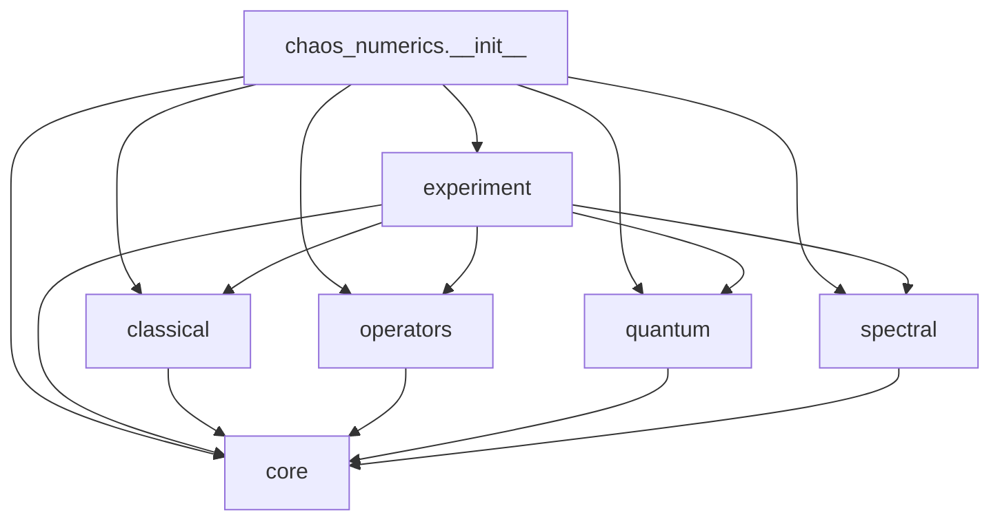

# Public API and Module Boundaries

Status: accepted baseline for KEN-109  
Applies to: Chaos Numerics Library v0.1  
Last reviewed: 2026-08-04

## 1. Goals

This document fixes the v0.1 package boundary, dependency direction, public
surface, and array conventions before implementation. It refines the workflows in
`docs/product/mvp-scope.md`; numeric tolerances and performance thresholds belong
to KEN-110.

The design has four constraints:

1. models and analysis algorithms remain separate;
2. discrete maps, future flows, and future billiards are not forced into one base
   class;
3. small dense reference implementations and scalable sparse/matrix-free
   implementations share result conventions without sharing one concrete class;
4. adding a model or analysis must not require a dependency cycle or a new
   top-level namespace.

The distribution name and import package are `chaos-numerics` and
`chaos_numerics`, respectively.

## 2. Package layout and responsibilities

```text
src/chaos_numerics/
├── __init__.py                 # curated stable re-exports only
├── _version.py                 # single source of __version__
├── core/
│   ├── __init__.py             # public common types and protocols
│   ├── protocols.py            # structural model/operator protocols
│   ├── types.py                # NumPy typing aliases
│   ├── results.py              # immutable result containers
│   ├── metadata.py             # provenance and convergence metadata
│   ├── exceptions.py           # public exception/warning hierarchy
│   ├── _payload.py             # shared private persistence-payload builders
│   └── _validation.py          # shared private runtime validation
├── classical/
│   ├── __init__.py             # classical public surface
│   ├── maps.py                 # StandardMap, CatMap, BakerMap
│   ├── trajectories.py         # iterate
│   ├── lyapunov.py             # Lyapunov algorithms
│   ├── transport.py            # correlation and transport statistics
│   ├── sections.py             # poincare_section, PoincareSection
│   └── periodic.py             # low-period orbit search
├── quantum/
│   ├── __init__.py             # quantum public surface
│   ├── states.py               # state construction and validation
│   ├── kicked_rotor.py         # KickedRotor, CylinderKickedRotor
│   ├── maps.py                 # QuantumCatMap, QuantumBakerMap
│   ├── unitary.py              # DenseUnitary, eigenstates, eigenphases
│   ├── evolution.py            # evolve, QuantumEvolution
│   ├── diagnostics.py          # loschmidt_echo, otoc, weyl_translations
│   └── phase_space.py          # coherent states, Husimi data, localization
├── operators/
│   ├── __init__.py             # transfer-operator public surface
│   ├── partitions.py
│   ├── ulam.py
│   └── eigensolvers.py
├── spectral/
│   ├── __init__.py             # spectral-statistics public surface
│   ├── levels.py               # prepare_eigenphases, unfold, spacings, gap ratios
│   ├── _ensembles.py           # shared private ensemble names and aliases
│   └── long_range.py           # form factor, number variance, RMT references
└── experiment/
    ├── __init__.py             # experiment public surface
    ├── config.py
    └── execution.py            # execution, sweep, storage, built-in adapters
```

### 2.1 `core`

`core` owns vocabulary shared by two or more domains:

- structural protocols: `ClassicalMap`, `Flow`, `QuantumMap`,
  `LinearOperatorLike`, `Partition`, and `SerializableResult`;
- state/operator NumPy typing aliases;
- immutable `Trajectory`, `Spectrum`, `EigenstateResult`, `AnalysisResult`, and
  metadata types;
- public exceptions and warnings;
- domain-neutral shape, dtype, and finite-value validation.

`core` contains no concrete classical or quantum model, numerical analysis,
plotting, persistence backend, or domain registry. It must import only the Python
standard library, NumPy, and typing support. SciPy types are accepted structurally
through protocols rather than imported into foundational result objects.

### 2.2 `classical`

`classical` owns discrete classical maps and algorithms whose inputs are a
`ClassicalMap`: trajectory generation, Lyapunov analysis, correlation, transport,
and periodic-orbit search. Algorithms must accept compatible user-defined maps,
not just the three built-in classes.

It does not own partitions or transfer-operator discretization. It does not expose
a concrete `Flow`, integrator, or flow-analysis implementation in v0.1; the
domain-neutral `core.Flow` protocol exists only as the contract required by
KEN-112 and is not a claim of flow feature support.

### 2.3 `quantum`

`quantum` owns finite-dimensional quantum states, unitary-map evolution, built-in
quantum maps, coherent states, Husimi data, and state-localization measures.
Eigenphase extraction may return the shared `Spectrum` type, but general spectral
statistics remain in `spectral`.

It does not import `spectral` to offer convenience methods. Users explicitly pass
the returned spectrum or phase array to `spectral` functions.

### 2.4 `operators`

`operators` owns partitions, Ulam construction, and sparse leading-eigenpair
analysis. Ulam construction accepts the `core.ClassicalMap` protocol, so it does
not import the `classical` package or know about concrete map classes.

The probability convention is column-stochastic:

```text
P[target_cell, source_cell] = Pr(target_cell | source_cell)
rho_next = P @ rho
```

Closed-system columns sum to one. Open systems must opt in explicitly. In v0.1,
`build_ulam(..., open_system=False)` is the default
contract: an out-of-domain image is an error. With `open_system=True`, the matrix
is substochastic and each column deficit is the source cell's escaped probability.
The implementation must expose those deficits as diagnostics; it never infers an
open system merely from a failed lookup. Deciding which sampled images escaped is
vectorized for the built-in rectangular partitions and falls back to one `locate`
call per point for a user-defined `Partition`, because the public protocol offers no
batch acceptance test. The two paths agree bit for bit; only the cost differs, by
about a factor of forty.

`UlamMatrix` is an immutable container composed of a canonical CSR matrix, the
per-column escape probabilities, and build metadata. It is deliberately not a
SciPy sparse subclass: subclassing exported seventy-odd SciPy methods as v0.1
contract and left the matrix mutable, so escape diagnostics could drift out of
step with the values they describe. The container forwards only `shape`, `dtype`,
`nnz`, `matvec`, `toarray()`, and `@`, which is enough to satisf
`core.LinearOperatorLike`; every other SciPy operation goes through the `.matrix`
attribute. Diagnostics do not survive such an operation, because the escape
probabilities of a product are not a function of the operands' escape
probabilities, so a caller who composes matrices carries the diagnostics
themselves. The stored CSR arrays and escape probabilities are read-only, and
`array_payload()` / `metadata_payload()` follow the same persistence convention as
the `core` result types. The constructor enforces column sums no greater than one,
which makes substochasticity an invariant of the type rather than something each
consumer rechecks.

### 2.5 `spectral`

`spectral` owns domain-neutral phase/level preparation, unfolding, spacing
statistics, spacing-distribution and gap-ratio references, spectral form factor,
number variance, Dyson-Mehta spectral rigidity, and Poisson/GOE/COE/GUE/CUE
references. It accepts arrays or `core.Spectrum` and returns core result types.

It must not import concrete quantum models, classical models, or plotting
libraries. Symmetry sectors are supplied as data/metadata rather than discovered
by importing model-specific code.

### 2.6 `experiment`

`experiment` owns configuration, single-run orchestration, parameter sweeps,
resume/progress behavior, seed derivation, and JSON/NPZ persistence. It is the only
layer allowed to compose built-in capabilities across sibling domains.

The generic runner operates on callables and core result types. String-based
built-ins are resolved inside `execution.py`, which is the only module allowed to
import public names from `classical`, `quantum`, `operators`, and `spectral`. No
sibling package may import `experiment`. An earlier draft of this document placed
that resolution in a separate `_registry` module; v0.1 keeps it in `execution.py`
and the isolation rule applies to that module instead.

## 3. Dependency direction

An arrow means “may import.” Every import points downward in this diagram:



More precisely:

| Importer | May import |
| --- | --- |
| `core` | standard library, NumPy, typing support |
| `classical` | `core`, NumPy, selected SciPy numerical routines |
| `operators` | `core`, NumPy, SciPy sparse/sparse.linalg |
| `quantum` | `core`, NumPy, selected SciPy FFT/linear algebra |
| `spectral` | `core`, NumPy, selected SciPy statistics/interpolation |
| `experiment` | `core`; public sibling APIs only in `execution.py` adapters |
| package `__init__` | public subpackage names solely for re-export |

Rules that enforce acyclicity:

- implementation modules never import from `chaos_numerics` top level;
- sibling numerical domains do not import one another;
- shared contracts move downward to `core`, not sideways to another domain;
- optional integrations live in an adapter owned by the higher-level consumer;
- type-only imports use protocols or `TYPE_CHECKING` and must not hide a runtime
  cycle;
- module import must not execute registry discovery, allocate large arrays, or
  import optional plotting/storage backends.

## 4. Public API

### 4.1 Meaning of public

A name is public only when all of the following are true:

1. it is documented in the API reference;
2. it is imported by a package or subpackage `__init__.py`;
3. it appears in that module's explicit `__all__`;
4. its behavior is covered by compatibility tests.

An import path into an implementation module, such as
`chaos_numerics.classical.maps.StandardMap`, may work but is not a supported user
contract. The supported path is `chaos_numerics.classical.StandardMap` or an
explicit top-level re-export listed below.

### 4.2 Top-level re-exports

The top level is intentionally small. It re-exports the most common concrete
models, core result types, experiment entry points, and version information:

```python
from chaos_numerics import (
    AnalysisResult,
    BakerMap,
    CatMap,
    EigenstateResult,
    Experiment,
    KickedRotor,
    QuantumBakerMap,
    QuantumCatMap,
    Spectrum,
    StandardMap,
    Trajectory,
    run_experiment,
    run_sweep,
)
from chaos_numerics import __version__
```

Analysis functions, protocols, partitions, helpers, and result-specific options
stay namespaced. This prevents collisions such as several meanings of `evolve`,
`spectrum`, or `sample` and leaves room for future models.

Top-level additions after v0.1 require evidence that a name is frequent,
unambiguous, and stable. Removing or changing one follows the deprecation policy
in section 9.

### 4.3 `core` public surface

```python
from chaos_numerics.core import (
    AnalysisResult,
    AnyArray,
    ArrayLike,
    ArrayPayload,
    BatchShape,
    BoolArray,
    ChaosNumericsError,
    ChaosNumericsWarning,
    ClassicalBatch,
    ClassicalMap,
    ClassicalState,
    ComplexArray,
    ConvergenceError,
    ConvergenceInfo,
    ConvergenceWarning,
    Diagnostic,
    EigenstateResult,
    ExperimentMetadata,
    FloatArray,
    Flow,
    IndexArray,
    LinearOperatorLike,
    NumericalError,
    NumericalWarning,
    OperatorArray,
    OperatorShape,
    Partition,
    QuantumBatch,
    QuantumMap,
    QuantumState,
    ReproducibilityWarning,
    SerializableResult,
    Shape,
    Spectrum,
    StateShape,
    Trajectory,
    ValidationError,
)
```

`ClassicalMap`, `Flow`, `QuantumMap`, `LinearOperatorLike`, `Partition`, and
`SerializableResult` are runtime-checkable structural protocols where runtime checks
are reliable.
Conformance primarily means possessing the documented methods and array behavior;
users do not subclass a library base class. The `Flow` protocol allows future
implementations to integrate without changing `core`, but v0.1 ships no flow
solver or concrete flow model.

### 4.4 Domain public surfaces

Type aliases that appear in a public signature are part of the public surface: a
package that ships `py.typed` has to let callers annotate their own code with the
same names. The listings here and in section 4.3 therefore include `Observable`,
`Method`, `Ensemble`, `Statistic`, `Window`, `Side`, `OperatorLike`,
`EvolutionMethod`, `SymmetrySector`, `CatMatrix`, the dtype and shape aliases from
`core`, and the persistence pair `AnyArray` / `ArrayPayload` that every
`array_payload()` returns. Aliases that exist only to constrain an implementation,
such as `CanonicalEnsemble`, and the `experiment` result union `Result` /
`RunStatus`, stay private.

Each listing is the module's complete `__all__`, and `tests/test_documentation.py`
asserts that, so a new export cannot land here without being named.

```python
from chaos_numerics.classical import (
    BakerMap,
    CatMap,
    LogisticMap,
    Method,
    Observable,
    PeriodicOrbitResult,
    PoincareSection,
    StandardMap,
    autocorrelation,
    find_periodic_orbits,
    iterate,
    largest_lyapunov_exponent,
    local_diffusion_exponent,
    lyapunov_spectrum,
    mean_square_displacement,
    poincare_section,
)

from chaos_numerics.operators import (
    OperatorLike,
    RectangularPartition,
    Side,
    UlamMatrix,
    UniformPartition,
    build_ulam,
    leading_eigenpairs,
    spectral_gap,
    stationary_density,
)

from chaos_numerics.quantum import (
    DEFAULT_DENSE_LIMIT,
    BoundaryPhases,
    CatMatrix,
    CylinderKickedRotor,
    DenseUnitary,
    EvolutionMethod,
    HusimiResult,
    KickedRotor,
    QuantumBakerMap,
    QuantumBasis,
    QuantumCatMap,
    QuantumEvolution,
    SymmetrySector,
    WignerResult,
    basis_state,
    coherent_state,
    desymmetrize,
    eigenphases,
    eigenstates,
    evolve,
    husimi_distribution,
    inverse_participation_ratio,
    loschmidt_echo,
    normalize_state,
    otoc,
    participation_ratio,
    quantum_state,
    shannon_entropy,
    unitarity_defect,
    weyl_translations,
    wigner_distribution,
)

from chaos_numerics.spectral import (
    Ensemble,
    PreparedEigenphases,
    SpacingDistributionResult,
    SpectralCurve,
    Statistic,
    UnfoldedSpectrum,
    Window,
    adjacent_gap_ratios,
    mean_gap_ratio_reference,
    number_variance,
    prepare_eigenphases,
    rmt_reference,
    spacing_distribution,
    spectral_form_factor,
    spectral_rigidity,
    unfold,
)

from chaos_numerics.experiment import (
    Experiment,
    ExperimentRun,
    SweepResult,
    cartesian_grid,
    load_result,
    run_experiment,
    run_sweep,
    zip_grid,
)
```

The v0.1 implementation may add documented configuration/result classes to the
owning subpackage. It must not add synonyms for the functions above.

## 5. Representative imports and workflows

### 5.1 Classical map and analysis

```python
import numpy as np

from chaos_numerics.classical import StandardMap, iterate, lyapunov_spectrum

model = StandardMap(kick_strength=5.0)
initial = np.array([0.1, 0.2], dtype=np.float64)
trajectory = iterate(model, initial, steps=10_000)
# A Lyapunov time average converges as 1/sqrt(steps), and the standard map is far
# slower than a uniformly hyperbolic one. Ask for the accuracy this run length can
# actually deliver rather than accepting the default and a ConvergenceWarning.
lyapunov = lyapunov_spectrum(model, initial, steps=10_000, convergence_rtol=5e-2)
```

### 5.2 Ulam approximation without a concrete-model dependency

```python
from chaos_numerics.classical import CatMap
from chaos_numerics.operators import UniformPartition, build_ulam, leading_eigenpairs

model = CatMap(matrix=((2, 1), (1, 1)))
partition = UniformPartition(bounds=((0.0, 1.0), (0.0, 1.0)), shape=(64, 64))
ulam = build_ulam(model, partition, samples_per_cell=256, seed=7)
spectrum = leading_eigenpairs(ulam, count=8)
```

### 5.3 Matrix-free quantum evolution and explicit spectral analysis

```python
from chaos_numerics.quantum import KickedRotor, basis_state, eigenstates, evolve
from chaos_numerics.spectral import adjacent_gap_ratios, prepare_eigenphases

model = KickedRotor(dimension=4096, kick_strength=8.0)
state = basis_state(dimension=model.dimension, index=0)
final_state = evolve(model, state, steps=100, method="fft").final_state

# Spectra come from the module-level `eigenstates`, never from a model method, and
# only at a dimension where an O(N**2) dense reference is affordable. `dense_limit`
# defaults to `DEFAULT_DENSE_LIMIT` and is the explicit guard: raise it
# deliberately rather than by accident.
reference = KickedRotor(dimension=1024, kick_strength=8.0)
spectrum = eigenstates(reference, dense_limit=1024)
prepared = prepare_eigenphases(spectrum, symmetry_sector="even")
ratios = adjacent_gap_ratios(prepared)
```

`prepare_eigenphases` accepts a 1-D array of phases or an `EigenstateResult`. It
does not accept `core.Spectrum`, whose eigenvalues are complex.

### 5.4 Reproducible sweep

<!-- docs-test: skip - writes a sweep directory to the filesystem -->
```python
from chaos_numerics.experiment import Experiment, cartesian_grid, run_sweep

experiment = Experiment(model="standard_map", analysis="lyapunov_spectrum", seed=7)
result = run_sweep(
    experiment,
    parameters=cartesian_grid(
        kick_strength=[0.5, 1.0, 5.0],
        steps=[20_000, 40_000],
    ),
    output="results/public-api-standard-map",
    resume=True,
)
```

Each study owns its `output` directory: a directory already holding a different
experiment or grid is rejected, not merged.

## 6. Naming conventions

| Item | Convention | Examples |
| --- | --- | --- |
| Packages/modules/functions/parameters | lowercase `snake_case` | `spectral_form_factor`, `kick_strength` |
| Classes and protocols | `PascalCase`; no `I` prefix | `StandardMap`, `ClassicalMap` |
| Result containers | descriptive noun, usually `Result` suffix | `AnalysisResult`, `EigenstateResult`; established nouns `Trajectory`, `Spectrum` omit it |
| Configuration containers | descriptive noun plus `Config` | `ExperimentConfig` (no v0.1 instance; the convention applies when one is added) |
| Exceptions | `Error` suffix | `ValidationError`, `ConvergenceError` |
| Warnings | `Warning` suffix | `NumericalWarning`, `ConvergenceWarning` |
| Constants | uppercase `SNAKE_CASE` | `DEFAULT_DENSE_LIMIT` |
| Type aliases | singular `PascalCase` | `ClassicalState`, `QuantumState`, `Ensemble` |
| Private names | one leading underscore | `_validate_state` |

Additional rules:

- names describe the mathematical quantity, not the implementation technique;
  implementation selection uses an explicit `method=` argument;
- use `count` for a number of requested outputs and reserve `k` for a physical
  parameter only where the literature/API documents it; model constructors use
  unambiguous names such as `kick_strength`;
- use `steps` for discrete evolution and `times` for evaluated physical times;
- use `dimension` for Hilbert-space dimension, `state_dim` for classical-state
  dimension, `shape` for array/partition extents, and `count` for eigenpair count;
- use `initial_state`, `final_state`, `eigenvalues`, `eigenvectors`, `eigenphases`,
  and `residuals` consistently; do not introduce `x0`, `vals`, or `vecs` publicly;
- stochastic functions accept keyword-only `seed`; they never mutate NumPy's
  process-global RNG;
- Boolean parameters use positive predicates such as `resume=True`; avoid double
  negatives;
- units and normalization appear in parameter/result metadata, never only in a
  function name.

## 7. Array, coordinate, and dtype conventions

### 7.1 General array rules

- Public APIs accept array-like inputs where conversion is unambiguous and convert
  once at the boundary with `numpy.asarray`.
- The final axis always stores state coordinates or Hilbert-space amplitudes.
- Any leading axes are batch axes and are preserved by elementwise model methods.
- Functions neither silently squeeze singleton axes nor reinterpret transposed
  inputs.
- Outputs are NumPy arrays unless the documented result is an immutable container
  that conforms to `LinearOperatorLike` and exposes its SciPy sparse matrix through
  a named attribute.
- Result containers own their arrays and expose read-only views. Callers request an
  explicit copy before mutation.
- Public results never rely on `numpy.matrix`.

### 7.2 Canonical shapes

Let `d` be a classical state dimension, `B...` zero or more batch dimensions, `T`
the number of stored times, `N` a Hilbert-space dimension, `K` an eigenpair count,
and `G...` a phase-space grid shape.

| Quantity | Scalar/single shape | Batched or extended shape |
| --- | --- | --- |
| Classical state | `(d,)` | `(*B, d)` |
| One map step | `(d,) -> (d,)` | `(*B, d) -> (*B, d)` |
| Classical trajectory | `(T, d)` | `(*B, T, d)` |
| Classical Jacobian | `(d, d)` | `(*B, d, d)` |
| Lyapunov spectrum | `(d,)` | `(*B, d)` when batching is supported |
| Quantum state | `(N,)` | `(*B, N)` |
| Quantum trajectory/history | `(T, N)` | `(*B, T, N)` |
| Dense operator | `(N, N)` | no implicit batch in v0.1 |
| Eigenvalues/eigenphases/residuals | `(K,)` | no implicit batch in v0.1 |
| Eigenvectors | `(N, K)` | columns are eigenvectors |
| Partition multi-index | `(partition_ndim,)` | `(*B, partition_ndim)` |
| Husimi/phase-space grid | `(n_q, n_p)` | optional state batch `(*B, n_q, n_p)` |

`iterate(..., steps=s, include_initial=True)` stores `T = s + 1`; with
`include_initial=False`, it stores `T = s`. The default is `True`.

### 7.3 Coordinate order and periodic boundaries

- Two-dimensional canonical phase-space states are ordered `(q, p)`.
- Bounds follow the same coordinate order: `((q_min, q_max), (p_min, p_max))`.
- Phase-space grids use NumPy `indexing="ij"`; a grid value is indexed
  `[q_index, p_index]`. Plotting adapters may transpose for display but numerical
  results do not.
- Partition multi-indices follow coordinate order. Flat indices use C order, so
  the final coordinate index changes fastest.
- A periodic interval is half-open: `[lower, upper)`.
- Normalization is `lower + mod(x - lower, upper - lower)`. Thus `upper` maps to
  `lower`, including within documented floating-point tolerance.
- A point exactly on an internal partition or Baker-map cut belongs to the cell or
  branch on its positive/right side. The terminal upper boundary first wraps to
  the lower boundary.
- Wrapped coordinates are stored in results by default. Algorithms that require
  unwrapped displacement must request or construct an explicit unwrapped series;
  no function guesses from discontinuities.

### 7.4 Dtypes

| Quantity | Canonical computation/output dtype |
| --- | --- |
| Classical states, trajectories, observables, residuals | `numpy.float64` |
| Quantum states, dense unitary operators, eigenvectors | `numpy.complex128` |
| Eigenvalues | `numpy.complex128` |
| Eigenphases, probabilities, densities | `numpy.float64` |
| Sparse Ulam matrix data | `numpy.float64` |
| Shapes, cell indices, permutations | `numpy.intp` unless a serialized format specifies a fixed width |
| Masks and convergence flags | `numpy.bool_` |

Numeric integer and floating inputs may be promoted to the canonical dtype.
Complex classical inputs, nonzero imaginary parts in real quantities, booleans as
numeric data, object arrays, non-finite values where unsupported, and unsafe shape
coercions raise `ValidationError`. v0.1 makes no precision or performance promise
for `float32`/`complex64`, even if an internal operation happens to accept them.

## 8. Model and operator protocols

Protocols specify behavior, not inheritance. KEN-112 implements the following
v0.1 contracts with NumPy typing and separate runtime boundary validation:

```python
from typing import Protocol

import numpy as np
from numpy.typing import ArrayLike, NDArray

from chaos_numerics.core import LinearOperatorLike


class ClassicalMap(Protocol):
    state_dim: int
    is_periodic: tuple[bool, ...]
    bounds: tuple[tuple[float, float], ...]

    def step(self, state: ArrayLike, /) -> NDArray[np.float64]: ...
    def jacobian(self, state: ArrayLike, /) -> NDArray[np.float64]: ...


class Flow(Protocol):
    state_dim: int

    def vector_field(self, time: float, state: ArrayLike, /) -> NDArray[np.float64]: ...
    def jacobian(self, time: float, state: ArrayLike, /) -> NDArray[np.float64]: ...


class QuantumMap(Protocol):
    dimension: int

    def apply(self, state: ArrayLike, /) -> NDArray[np.complex128]: ...
    def as_linear_operator(self) -> LinearOperatorLike: ...


class LinearOperatorLike(Protocol):
    shape: tuple[int, int]
    dtype: np.dtype[Any]

    def matvec(self, vector: ArrayLike, /) -> NDArray[Any]: ...


class Partition(Protocol):
    ndim: int
    shape: tuple[int, ...]
    size: int

    def locate(self, points: ArrayLike, /) -> NDArray[np.intp]: ...
    def ravel_index(self, multi_index: ArrayLike, /) -> NDArray[np.intp]: ...
    def unravel_index(self, flat_index: ArrayLike, /) -> NDArray[np.intp]: ...
    def cell_bounds(self, index: int, /) -> NDArray[np.float64]: ...
    def sample(self, index: int, count: int, *, seed: int | None = None) -> NDArray[np.float64]: ...
```

`Partition.locate` returns C-order flat indices. `unravel_index` returns the
canonical trailing-coordinate multi-index shape documented in section 7.2;
`ravel_index` is its exact inverse for valid indices.

`iterate` and `evolve` are free functions because they add history allocation,
validation, and metadata around a single-step protocol. Concrete models may offer
small convenience methods, but algorithms depend on protocol methods and the free
functions remain the documented common API.

## 9. Internal API and compatibility policy

### 9.1 Internal boundaries

- A module or name beginning with `_` is private and may change without notice.
- Underscore-free implementation-module paths are still non-public unless exported
  in the owning subpackage `__all__` and documented.
- Tests may import private helpers only to test a difficult numerical invariant;
  public behavior tests are preferred.
- Cross-domain code must not import another domain's private modules or names.
- Shared private validation belongs in `core._validation`; domain-specific helpers
  remain in the owning domain.
- Optional dependencies are imported inside the feature or adapter that requires
  them and fail with a targeted installation message.
- Serialized results contain a schema version independent of the package version.
  Readers validate the schema and use explicit migrations; they never infer it from
  array shape alone.

### 9.2 Compatibility

The compatibility contract covers documented exports, call signatures, result
field meanings, canonical array shapes/dtypes, coordinate conventions, and saved
schema behavior.

Before v1.0, a breaking public change still requires:

1. a documented replacement;
2. a `DeprecationWarning` at the old call site for at least one minor release;
3. a changelog entry and migration example;
4. compatibility tests during the deprecation window.

Numerically correcting a demonstrably wrong result may happen sooner, but must be
called out in release notes and, when practical, accompanied by an opt-in legacy
mode for one minor release. Private APIs receive no deprecation period.

## 10. Extension review

- Future flows use the separate `core.Flow` protocol already required by KEN-112
  and receive a concrete module only when that scope begins. They must not add
  dummy time arguments to `ClassicalMap`. Flows are the named v0.2 candidate in
  `mvp-scope.md` section 4, and the entry criterion recorded there is a design
  document before an implementation: the integrator family, the error control, how
  the variational equations are propagated, and how event detection meets a fixed
  output grid are policy choices, and writing a solver settles none of them.
- Future billiards need collision/event contracts distinct from both maps and
  flows; no v0.1 placeholder is created.
- New classical or quantum maps implement a core protocol and live in the owning
  domain without changing analysis imports.
- New Ulam-compatible user maps require no registration because `build_ulam`
  consumes the structural `ClassicalMap` protocol.
- New experiment backends integrate through storage/runner adapters; they do not
  add backend methods to result objects.
- JAX/CuPy support would require an explicit array-backend design. The NumPy return
  contract is not weakened in anticipation of it.
- Numba may accelerate private kernels while preserving the public NumPy API.
- Plotting belongs in examples or a future optional visualization package. Core
  numerical modules continue to return plot-ready arrays plus metadata.

## 11. Decisions and rationale

| Decision | Rationale |
| --- | --- |
| Structural protocols instead of a common base hierarchy | Supports user models and avoids coupling unrelated system types. |
| `core` as the only shared lower layer | Prevents sibling-domain cycles and makes ownership obvious. |
| Classical analysis stays in `classical` | Its algorithms require classical-map semantics and this avoids an overly broad `analysis` grab bag. |
| Phase-space state analysis stays in `quantum` | Coherent/Husimi conventions depend on quantum basis and boundary-phase semantics. |
| Spectral statistics remain model-neutral | The same functions can consume quantum eigenphases or other prepared spectra. |
| Ulam code depends on `ClassicalMap`, not built-in maps | User-defined maps work without registration and `operators` stays independent of `classical`. |
| Minimal top-level re-exports | Common workflows remain convenient while specialized names stay unambiguous and extensible. |
| Trailing state axis and batch-leading trajectory shape | Scalar and batch calls compose naturally and coordinate order remains stable. |
| Half-open periodic domains | Boundary ownership is deterministic and agrees with modulo normalization. |
| Column-stochastic Ulam matrices | A density column vector advances naturally as `rho_next = P @ rho`. |
| Canonical float64/complex128 outputs | Establishes predictable precision and interoperability for v0.1 validation. |

## 12. Traceability

- KEN-108 and `docs/product/mvp-scope.md` define the product boundary.
- KEN-109 and this document define names, dependencies, and data conventions.
- KEN-110 will define tolerances, convergence checks, and performance thresholds.
- KEN-111 through KEN-129 implement and validate the design.
